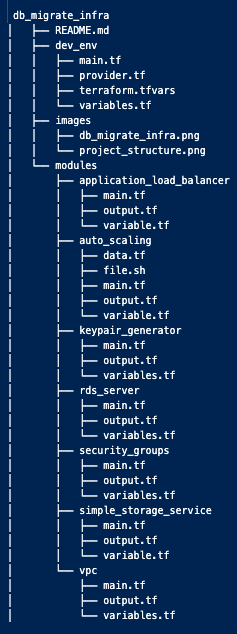

# db_migrate_infra

    This is infrastructure code for database migration from on premises to the aws cloud database. We have used terraform for provisioning infrastructure.

## Structure of the Project

## Structure of the Project is :

## Provisioning the infrastructure the following commands are executed on directory dev_env

### To initialize and loads resources

    terraform init

### To apply infrastructure

    terraform apply --auto-approve

### To destroy the infrastructure

    terraform destroy --auto-approve
